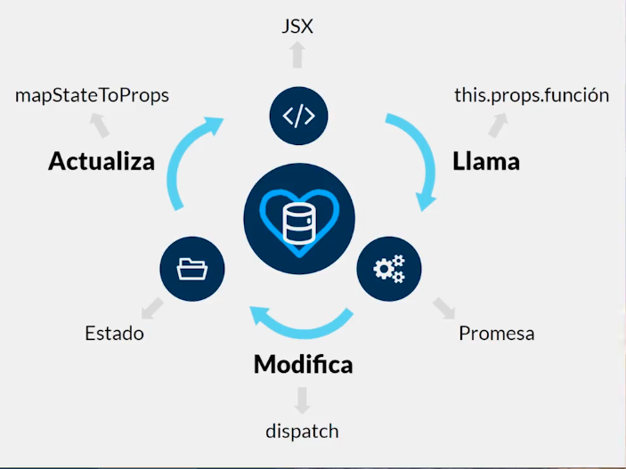

# Redux

## ¿Qúe es Redux, cuándo usarlo y por qué?

Redux es una herramienta de uso libre que nos deja almacenar todo el estado de una aplicación en un sólo lugar.

Sis principios son:
- Almacenamiento
- Inmutable
- Centralizado

Redux es un contenedor predecible del estado de aplicaciones JavaScript. Te ayuda a escribir aplicaciones que se comportan de manera consistente, corren en distintos ambientes (cliente, servidor y nativo), y son fáciles de probar.

Otras bibliotecas que permiten trabajar con información son:
- Relay
- Apolo


[Redux](https://es.redux.js.org/) es un contenedor predecible del estado de aplicaciones JavaScript.
Puedes usar Redux combinado con React, o cual cualquier otra librería de vistas. Es muy pequeño (2kB) y no tiene dependencias.


## Introducción: las fases de Redux

Los cuatro pilares de Redux son:
- **Store**: Almacenamiento
- **Reducers**: Estados
- **Action Creators**: Funciones
- **Componente**: Código JSX


## Store 

El *store* tiene las siguientes responsabilidades:
- Contiene el estado de la aplicación
- Permite el acceso al estado vía `getState()`
- Permite que el estado sea actualizado vía `dispatch(action)`
- Registra los listeners vía `subscribe(listener)`
- Maneja la anuliación del registro de los listeners via el retorno de la función de `subscribe(listener)`


**Instalación de Redux**

Para usar redux, necesitamos instalar la librería

- `npm install redux react-redux`


## Reducers

Las *Action Creators* describen que algo pasó, pero no especifican cómo cambió el estado de la aplicación en respuesta. Esto es trabajo de los reducers.

El *Provider* es el componente de Redux en el cual encerraremos nuestra aplicación para que puedan comunicarse los componentes entre ellos.

**Creación de los reducers**

Vamos a la carpeta `src` y creamos un directorio llamado ``reducers`, todo en minúscula. Dentro de él creamos un archivo llamado `index.js` 

- [reducers/index.js](blog/src/reducers/index.js)


## Conexión a un componente

1. Como puntos previos ya en esta clase debes tener instalado redux y haberlo configurado en el index.js de tu app

2. Importa el método connect de React Redux
`import { connect } from "react-redux"`

3. Mapea el estado de redux a los props del componente llamando a los reducers que te interesen usar, en este caso para mi fue usersReducer

```js
const mapStateToProps = (reducers) => {

  return reducers.usersReducer;

}
```

4. Exporta tu componente usando el método connect para tenerlo conectado a los reducers y actions de Redux.

```js
export default connect(mapStateToProps, {/*actions*/} )(Users);
```

- [users/index.js](blog/src/components/users/index.js)

## Action Creators

Para manejar el **action creators**, creamos una carpeta llamada **actions** dentro del directorio `src`. Allí creamos un archivo llamado `usuariosActions.js`

**dispatch** Es el que va a disparar esa llamada y va a contactar al reducer para hacer el cambio de estado.

- [actions/usuariosActions.js](blog/src/actions/usuariosActions.js)

## Redux Thunk

Redux Thunk permite a las *action creators* invertir el control despachando funciones. Van a recibir dispatch como argumento y capaz llamarlo asíncronamente. Estas funciones son llamas *thunks*.

- `npm install redux-thunk`

- [src/index.js](blog/src/index.js)


## Explicación teórica: ciclo completo de Redux

Cuando nuestro componente terminar de cargar (`componentDidMount`) llama al *Action Creator*, luego el Action Creator contiene la promesa, trae los datos necesarios y luego va y modifica al *Reducer* para que actualice el estado usando *dispatch()* y luego lo actualizamos en el componente con el *mapStateToProps*.




## 5. Fases Extra

Son las fases extras que no son obligatorias para usar Redux pero son altamente recomendables.

## Archivos Types

Es una forma de evitar errores de escritura en el código

Para ello creamos una carpeta en `src` llamada **types** y dentro de ella incluimos un archivos llamado *usuariosTypes.js*

En este archivo lo que definimos son las constantes que hace referencia a ese caso. Para implementar se llama desde el archivo que se require

- `usuariosTypes.js`
```js
export const TRAER_TODOS = 'traer_usuarios';
```

- Archivo donde lo requiera
```js
import { TRAER_TODOS } from '../types/usuariosTypes'
```


### Try Catch

**`try`** permite definir un bloque de código para que se analice en busca de errores mientras se ejecuta.

**`catch`** permite definir un bloque de código para ejecutarse, si se produce un error en el bloque `try`.

```js
try {  
// Bloque de código a intentar
}  
catch(Exception _e_) {  
// Bloque de código para manejar errores
}
```


### Escenarios asíncronos

Es útil para manejar los estados cuando se hace la llamada.


### Componente Spinner

Se muestra el evento cargando al usuario.

[Pure CSS Loaders](https://loading.io/css/)


### Componente Fatal

Este componente se crea en caso de que algo haya salido mal. Este archivo es un componente funcional que muestra el mensaje de error en caso de que lo haya.

### Tabla como componente funcional

Se crea un nuevo componetes para limpiar el `index` de **user**. De esta forma hacemos un componente especial para manejar los datos de la aplicación.


**_En resumen_**

- Manejar todos los errores con **types** para identifica mejor el error
- Se manejan todos los 3 estados obligatorios
  - Cargando
  - Error
  - Todo OK
- Se limpia el código separando los componentes


## 6. Compartir información en Redux


### Parámetros por URL

Para pasar parámetros por url, debemos colocar el valor en `Link` y definir la ruta con **`:parametro`** para recibir el valor

* [user/Tabla.js](blog/src/components/users/Tabla.js)
Enviamos el parámetro por url a traves de **Link**
```js
<Link to={`/publicaciones/${key}`}>
  <div className="eye-solid icon"></div>
</Link>
```

* [components/App.js](blog/src/components/App.js)
Creamos la ruta en App.js y colocamos el comodín **:parameter**
```js
<Route exact path='/publicaciones/:key' component={Publicaciones} />
```


* [publicaciones/index.js](blog/src/components/publicaciones/index.js)
Recibimos la variable en el componente clase a través de:
```js
{this.props.match.params.key}
```


### Compartir Reducer

Como ya se tiene el reducer de usuarios, podemos compartirlo y agregarlo al nuevo componente *publicaciones* que hemos creado. Para ello también llamamos las acciones de la clase usuario para poder utilizarlos en este nuevo componente.

Para eso ver el archivo [publicaciones/index.js](blog/src/components/publicaciones/index.js)


### Multiples reducer

Se crea otro reducer para el componente de publicaciones, también se debe crear las acciones para ese reducer. Sim embargo, se entra en un conflicto al utilizar el mismo nombre para la llamada de datos con el reducer.

### Llamando a múltiples reducers en una acción

### Evitar segundas búsquedas

**NOTA !WARNING**

Se ha solucionado el error dónde no cargaban los datos adecuados para el **reducer**. Esto sucedió porque en el [`index.js`](blog/src/reducers/index.js) de la carpeta *reducer* no se importó el archivo adecuado para el **combineReducer()**

```js
import { combineReducers } from 'redux';
import usuariosReducer from './usuariosReducers';
// import publicacionesReducer from './usuariosReducers';
import publicacionesReducer from './publicacionesReducer';

export default combineReducers({
  usuariosReducer,
  publicacionesReducer
});
```

Para evitar las segundas búsquedas, cargamos la búsqueda que haya realizado el usuario almacenando los valores en el estado. De esta forma cada vez que se seleccione un usuario se tiene almacenada la información respectiva para el usuario.

Además para evitar la carga de usuarios en el ítem usuarios, se coloca el condicional en el `componentDidMount()` verificando que no hayan usuarios en el estado, de esta forma evitamos que se llame la función de búsqueda nuevamente.


```js
componentDidMount() {
    if (!this.props.usuarios.length) {
      this.props.traerTodos();
    }
  }
```


### Inmutabilidad

Se modifica el archivo [publicacionesActions.js](blog/src/actions/publicacionesActions.js)  agregando una nueva constante de publicaciones key al arreglo de **usuarios_actualizados** que se agrega aun nuevo dispatch


### Evitar sobrescritura

Como el **Reducer es el estado**, el estado se actualiza y el `componentDidMount()` se ejecuta una vez después del `render()`.
Entonces como es estado puede variar, y no se puede destructuras.


### Validación compuesta

En esta parte se despliega la información completa del usuario, es decir, mostrar las publicaciones.


### Validación de errores

Se hacen validaciones para las publicacionesReducer
**NOTA** Es importante revisar las llamadas en las importaciones de los archivos. Siempre verificar que se están llamando las adecuadas.


### Modificando respuestas de URL

Se traerán los comentarios para las publicaciones. A las publicaciones se añadirán los comentarios de maneta dinámica.

Para crear usar funciones dentro de las acciones y llamarlas desde los componenes, debemos crearla y exportarla en el [usuariosActions.js](blog/src/actions/usuariosActions.js). Luego debemos agregarla en el mapDispatchToProps y desestructurarla en el objeto que la estamos llamando.

Finalmente se llama la función tal cual en el evento

```js
onClick={() => this.props.abrirCerrar()}
```

- [Ver publicaciones/index.js](blog/src/components/publicaciones/index.js)


Las  publicaciones es una arreglo de arreglos, por eso se necesita el **publication key** y la posición de la publicación (`com_key` comentario key)


### Estado con interacción